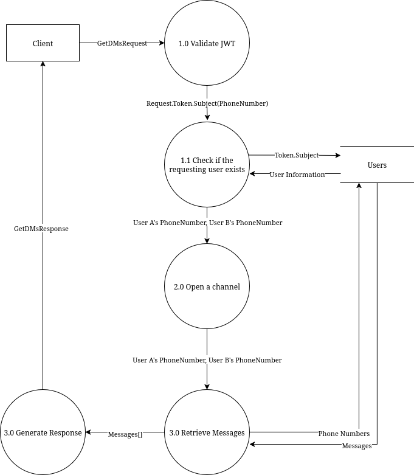

## How to read this document
Processes numbered 1.x are always contained within a **validateXRequest** method. Those are defined in `src/server/validation.go`
Processes of other numbers are done within a **doXWork** method, defined in `src/server/procedures.go`. An exception is the "Generate Response" process. That is done in the server handler directly. the **doXWork** functions only return message types, not responses.
Any failure within any step will generate an error code that is then sent to the user.

## RegisterUser


The procedure starts when the **Client** sends a RegisterUserRequest defined as such:

| **Property** | **type** |
|----------|------|
| Username| string|
|PhoneNumber| string|
|Password| string|

### **Process 1.0**
A query is sent to the database in order to check whether or not the user already exists. The query is defined as such:
``` SQL
SELECT * FROM USERS WHERE phone_number = ? LIMIT 1;
```
If any rows are returned, the process will return an error.

### **Process 2.0**
A **24 byte salt** is randomly generated. Then it will be hashed along the password using **PBKDF2** and **SHA512**. The parameters for the hashing function are hard-coded in `src/server/procedures.go`. A **key size** of 32 bytes, and a **210,000 iterations** as per the [OWASP Recommendation](https://cheatsheetseries.owasp.org/cheatsheets/Password_Storage_Cheat_Sheet.html#pbkdf2).

### **Process 2.1**
The phone number, user name, hashed password, and salt are stored in the database.

### **Process 3.0**
A JWT is generated following this example:

| **Key**  | **Value** |
|------------|-------------|
|username| John Doe |
|sub|123-456|
|iat|2025-08-24T16:57:26.000Z|
|exp|2025-09-11T16:57:26.000Z|

Sub being the user's phone number, iat and exp are RFC3339 time strings.

### **Process 4.0**
The response is serialised and sent to the client

## Login


### **Process 1.0**
Perform simple validations of the request such as checking if any fields are empty or invalid.

### **Process 2.0**
Will query the database for a user account using the phone number provided by the request.

### **Process 2.1**
The password provided in the request is salted and hashed.

### **Process 2.2**
The passwords are compared, if do not match, the function will return an error instead of a JWT.

### **Processes 3.0 and 4.0**
The are identical to the ones in the [RegisterUser](#RegisterUser)

## GetUserInfo


### **Process 1.0**
The JWT is decoded and validated by checking whether or not it is expired.

### **Process 1.1**
The database is queried for a user using the phone number retrieved from the token.

### **Process 2.0**
The database is queried for a user matching the phone number contained in the request. If a user is not found, an error will be returned


## GetDMs


### **Processes 1.0 and 1.1**
These are identical to the ones in [GetUserInfo](#GetUserInfo)

### **Process 2.0**
A channel will be opened and stored in a map. It's key will be a concatenated string of UserA's number with UserB's. This channel will be used to instantly receive messages via server stream as soon as theyre sent.

### **Process 3.0**
The database will be queried for direct messages between the requesting **User A** phone number(contained in the token and request) and the target **User B**(contained in the request). The query used:
```sql
SELECT * FROM messages
WHERE receiver in (?, ?) AND sender in (?, ?)
AND timestamp BETWEEN ? AND datetime('now');
```
`(?, ?)` will receive both numbers for the sender and receiver, It will enable the retrieval messages going in both directions.
The messages are then serialised into an array of the type **Message** defined as:
| Property | Type | Required |
|----------|------|----------|
|Id | int | False |
|Sender | string | True |
|Receiver | string | True |
|Content| string | True |
|Timestamp| string | False |

## SendMessage


### **Process 2.0**
The message is stored in the database and it's row is retrieved, then scanned and turned into a "Message" type containing a timestamp and an id.

### **Process 2.1**
In this step, the server checks whether the receiver has an open channel. If not, **Process 3.0** will be skipped.
