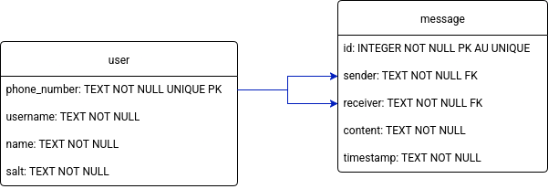

# GoMessenger
*last updated:* 2025/08/28

## Overview
This small messaging app is intended to showcase my ability to use Golang to deliver software all by myself.

## Goals and Non-Goals
### Goals
* Creating a messaging app that can deliver messages between two users.

### Non goals
* Supporting video or voice calls
* Supporting gifs, images, videos, or voice notes.
* Making it a commercialy viable application
* Showcasing graphics design skills

## Database Model


The messages table will use a text field to store an **ISO 8601** timestamp. This might be changed in the future when a new DBMS is introduced. SQlite will be used initially for simplicity's sake.

At present, the app will only allow conversations between two users, despite the model's capacity to handle group chats. As has been stated before in this document, they will be implemented at a later date.

One thing to be noted is that the phone number in the "users" table won't be an actual phone number. It's purpose is to give the users a public ID to talk to each other. This also serves to mimic how messaging apps work.

### Database Queries
#### Retrieving chat messages between two users:
```sql
SELECT * FROM messages
WHERE receiver in (?, ?) AND sender in (?, ?)
AND timestamp BETWEEN ? AND datetime('now');
```

The starting date of the query should be defined by the service. It will be based on the most recent message a user has in their chat. Therefore, if a user has no messages stored locally, the value should be the unix epoch.

The function executing this query should receive two "phone numbers" as strings. The input must be numerical only. for example ```123-456``` a 6-digit format can accomodate up to 1 million users.

#### Sending a message to another user:
```sql
INSERT INTO messages(
sender, receiver, content, timestamp
) VALUES ( ?, ?, ?, datetime('now'));
```
